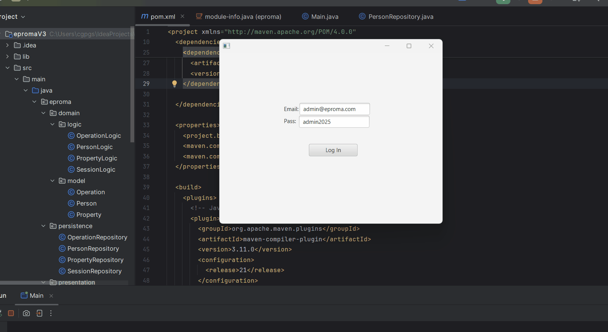

# EPROMA 2025

JavaFX desktop application for managing real estate properties and transactions.

## Demo



## Technologies
- Java 21
- JavaFX 21
- MySQL 8
- JDBC

## Project Structure
- `src/`: Source code
- `lib/`: External libraries (`.jar` files)
- `epromadb_dump.sql`: MySQL database dump

## Example User
- Email: `admin@eproma.com`
- Password: `admin2025`

## How to Run
1. Open the project in IntelliJ IDEA
2. Make sure JavaFX SDK and MySQL Connector/J are added to the classpath
3. Run `Main.java`

## Database
Import the `epromadb_dump.sql` file into your local MySQL server:
```bash
mysql -u root -p epromadb < epromadb_dump.sql
